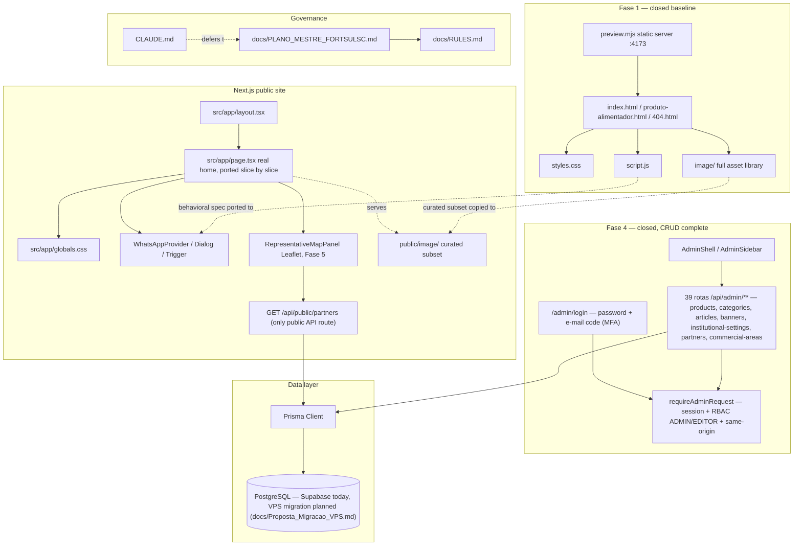
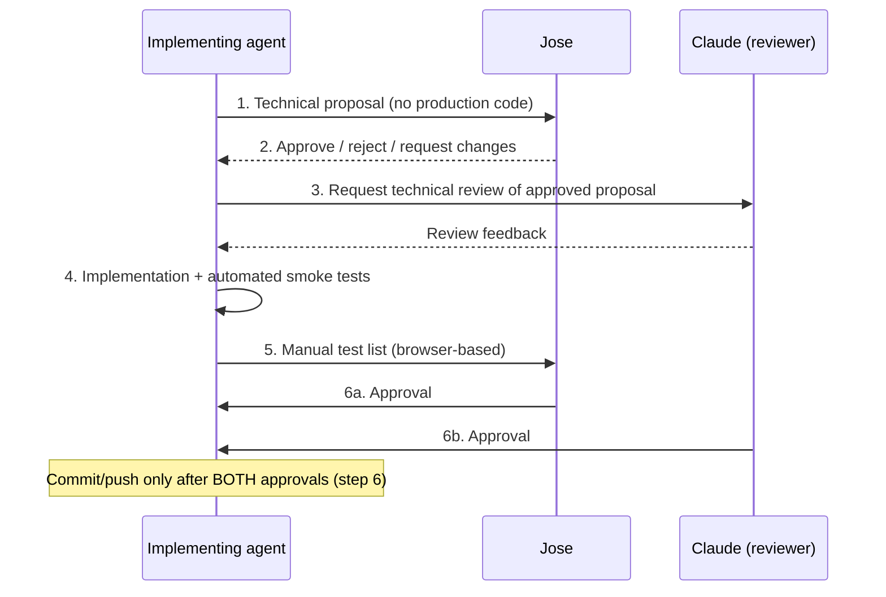

# Codebase Map

> Maintained technical map. Last full mapping: 2026-09-07. Manually refreshed 2026-09-14 (Fase 4 admin panel, Prisma/Postgres, and the Fase 5 public API — none of which existed at the last full mapping) — `total_files`/`total_tokens` above still reflect the 09/07 run, not this partial refresh; a full re-run of the mapping tool would be needed to update those two numbers accurately.
>
> Scope note: this map covers the FortSulSC project itself (root config/legacy site, `docs/`, `src/`, `tasks/`, static assets). It excludes `.agents/skills/**`, a vendored third-party `addyosmani/agent-skills` package (pinned by `skills-lock.json`) that is tooling, not project code.

## System Overview

FortSulSC is **mid-migration**: a legacy static HTML/CSS/JS site (still the production baseline for most of the public page) sits alongside a Next.js/React/TypeScript app that has grown well past the original WhatsApp-widget slice. The Next.js app now includes a **full administrative panel with CRUD** (Fase 4, formally closed 12/09/2026) backed by **Prisma + PostgreSQL**, plus the project's **first public dynamic API route** (Fase 5, in progress) serving a Leaflet-based representative map. Both the legacy static pages and the Next.js app still run side by side in the same repo.



Behind everything sits a strict documentation/governance layer (`docs/`) that gates anything beyond the approved scope — no new backend, database, auth, or business rule may be implemented without Jose's explicit approval, even now that the admin panel and Prisma/Postgres are real and in use. `docs/API.md` documents the real contract of all 40 routes.

## Directory Structure

```
FortSulSC/
├── index.html, produto-alimentador.html, 404.html   # legacy static pages (Fase 1, closed baseline)
├── styles.css, script.js                            # legacy design system + interactivity
├── preview.mjs, test-preview.mjs                     # static file server + its smoke test
├── robots.txt
├── next.config.ts, tsconfig.json, package.json       # Next.js/TS app config (Fase 2)
├── vitest.config.ts, vitest.setup.ts                 # Vitest unit-test setup (jsdom + <dialog> polyfill)
├── CLAUDE.md, README.md                              # fast-entry agent/dev instructions (defer to Plano Mestre)
├── skills-lock.json                                  # lockfile for vendored agent-skills package
├── docs/                                              # governance, architecture, design-system, planning docs
├── prisma/                                            # schema.prisma, migrations/, seed.ts, data/ (IBGE geography seed)
├── src/
│   ├── app/
│   │   ├── (public routes)                            # layout.tsx, page.tsx, globals.css — home + WhatsApp + map
│   │   ├── admin/                                     # admin panel pages: login, dashboard, products/categories/
│   │   │                                               # articles/banners/partners/commercial-areas/settings
│   │   └── api/
│   │       ├── admin/**                                # 39 rotas — CRUD administrativo, requireAdminRequest
│   │       └── public/partners/                        # única rota pública dinâmica (Fase 5)
│   ├── components/                                    # whatsapp/, admin/, representatives/, content/, sections/,
│   │                                                   # solutions/, support/, about/, layout/, ui/
│   └── lib/
│       ├── auth/                                       # next-auth config, RBAC guard, rate-limit, e-mail sender
│       ├── content/                                    # repositórios de domínio (products, partners, articles…)
│       ├── db/                                         # Prisma client singleton
│       ├── storage/                                    # ImageStorage trocável (local/r2/supabase)
│       ├── security/                                   # security headers / CSP
│       ├── audit/ e rbac/                               # AuditLog, checagem de papel
│       └── logger.ts                                    # logger aprovado do projeto
├── tasks/                                             # plan.md / todo.md — Fase 2 execution tracking (stale, see Gotchas)
├── image/                                             # full legacy asset library (source for static site)
├── public/image/                                      # curated WebP subset served by Next.js
└── .agents/skills/                                    # vendored addyosmani/agent-skills package (not project code)
```

## Module Guide

### Legacy static site (Fase 1 — formally closed baseline)

**Purpose**: The current, fully functional production site. Still the visual and behavioral source of truth for the ongoing migration.
**Entry point**: `index.html`, served locally via `preview.mjs` (port 4173, `npm run preview`).

| File | Purpose | Tokens |
|------|---------|--------|
| `index.html` | Home page: header/nav, hero, category strip, about, solutions+filters, support, presence/map, "Novidades e dicas", CTA, footer, WhatsApp dialog | 5,385 |
| `produto-alimentador.html` | Product detail page for the one existing product (Alimentador de Cavaco/Briquete/Pellets) | 2,599 |
| `404.html` | Not-found page, uses absolute paths (served from any nested route) | 646 |
| `styles.css` | Full design system: `:root` tokens, section-organized rules, responsive breakpoints (1050/820/560px) | 8,814 |
| `script.js` | Mobile menu, sticky header, solution filter tabs, scroll-reveal (`IntersectionObserver`), footer year, WhatsApp `<dialog>` behavior | 1,120 |
| `preview.mjs` | Zero-dependency static HTTP server with hardened path-traversal defenses | 795 |
| `test-preview.mjs` | `node:test` smoke test incl. path-traversal attack payloads | 805 |
| `robots.txt` | Open crawler policy, no sitemap yet | 7 |

**Exports**: N/A (plain HTML/CSS/JS, no module system).
**Dependencies**: `image/` for assets; no external libraries or bundler.
**Dependents**: Behavioral/visual spec for the Next.js migration — `src/app/globals.css` and the WhatsApp React components are direct ports of `styles.css`/`script.js`.

**Known open item**: `index.html`'s "Novidades e dicas" section holds explicit test/placeholder content (flagged inline with `<!-- TESTE -->`, spec in `docs/PROMPT_CODEX_SECAO_NOVIDADES_E_DICAS.md`) — must be replaced before launch. Its solution-filter categories (`biomassa|fumageiro|equipamentos`) are also documented as **outdated**; the corrected set is `aviario|equipamentos|fumageiro|piscicultura|secadores` per `docs/PLANEJAMENTO_PROJETO.md`.

### Next.js public site (home page, WhatsApp, representative map)

**Purpose**: The real public frontend. Unlike the state at the last full mapping (07/09/2026), the home page is no longer a placeholder — the legacy sections (hero, category strip, about, solutions, support, presence, "Novidades e dicas", footer) have all been ported, slice by slice (see `docs/COMPONENTS.md`, the canonical source for the current component inventory — not duplicated here to avoid drift). The two biggest additions since the last mapping are the **representative map** (`RepresentativeMapPanel`, Leaflet + `/api/public/partners`, Fase 5) and the underlying **admin panel + Prisma/Postgres** that now powers most of this content (see next subsection).
**Entry point**: `src/app/layout.tsx` → `src/app/page.tsx`, served via `next dev`/`next build`/`next start`.

| File | Purpose | Tokens |
|------|---------|--------|
| `src/app/layout.tsx` | Root layout (Server Component): metadata/viewport ported from `index.html`'s `<title>`/meta description | 151 |
| `src/app/page.tsx` | Real home route — composes the ported sections (Server Components fetching real data where applicable, e.g. `ContentSection`/articles, `BannerStrip`) | — |
| `src/app/globals.css` | Design tokens + base reset; grows one "Fatia N" slice at a time as sections are ported | 1,322+ |
| `src/lib/whatsapp.ts` | `WHATSAPP_PHONE_DISPLAY`, `WHATSAPP_PHONE_TEL`, `WHATSAPP_CHAT_URL` constants | 52 |
| `src/components/whatsapp/WhatsAppProvider.tsx` | Context provider: `isOpen` state, `triggerRef`, `useWhatsApp()` hook, renders one shared dialog | 253 |
| `src/components/whatsapp/WhatsAppTrigger.tsx` | Reusable button that calls `openDialog(event.currentTarget)` | 123 |
| `src/components/whatsapp/WhatsAppDialog.tsx` | Native `<dialog>` modal: focus trap, Escape, overlay click, focus-on-open — 1:1 port of `script.js` | 816 |
| `src/components/whatsapp/FloatingWhatsApp.tsx` | Fixed-position floating action button (a styled `WhatsAppTrigger`) | 322 |
| `src/components/whatsapp/WhatsAppDialog.test.tsx` | Unit tests: open/close, focus-on-open, Escape, overlay vs. inside-click, Tab/Shift+Tab wrap | 710 |
| `src/components/whatsapp/whatsapp-flow.test.tsx` | Integration test: full Provider→Trigger→Dialog flow, focus returns to the exact trigger | 265 |
| `next.config.ts` | `{ agentRules: false }` — stops Next.js 16.1+ from auto-injecting a rules block into `CLAUDE.md` | 106 |
| `tsconfig.json` | Strict TS, `moduleResolution: bundler`, path alias `@/* → ./src/*` | 198 |
| `vitest.config.ts` | jsdom env, `tsconfigPaths()` + `@vitejs/plugin-react`, setup file `vitest.setup.ts` | 73 |
| `vitest.setup.ts` | RTL `afterEach(cleanup)` + `HTMLDialogElement.showModal/close` polyfill for jsdom | 206 |

**Exports**: `WhatsAppProvider`, `useWhatsApp()`, `WhatsAppTrigger`, `WhatsAppDialog`, `FloatingWhatsApp`, WhatsApp constants, plus every section component under `src/components/**` listed in `docs/COMPONENTS.md`.
**Dependencies**: `next@^16.2.9`, `react`/`react-dom@^19.2.7`, `leaflet`/`react-leaflet` (representative map), Testing Library + Vitest, ESLint (`npm run lint`/`lint:types`) — configured and enforced, not deferred anymore.
**Dependents**: `src/app/page.tsx` composes most of these; `RepresentativeMapPanel` additionally depends on `/api/public/partners`.

### Next.js admin panel (Fase 4 — closed, CRUD complete) + data layer

**Purpose**: `/admin/**` — authenticated, RBAC-protected panel for managing every piece of public content: products, categories, articles ("Novidades e dicas"), banners, institutional settings, partners/representantes/revendas, commercial areas and their linked municipalities. Backed by Prisma + PostgreSQL (Supabase today; VPS migration planned, `docs/Proposta_Migracao_VPS.md`).
**Entry point**: `/admin/login` (password, then an e-mail code for MFA) → `src/app/admin/(dashboard)/layout.tsx` (redirects to login if `auth()` finds no session) → per-resource pages under `src/app/admin/**`.

| Area | Where | Notes |
|---|---|---|
| Auth / session | `src/lib/auth/**` | `next-auth` config, `requireAdminRequest` (session + RBAC + same-origin guard for every mutating admin route), rate limiting (login attempts and `/api/public/partners`), e-mail sender for the MFA code (provider swappable via `EMAIL_PROVIDER`, `src/lib/auth/email-config.ts`) |
| RBAC | `src/lib/rbac/` | Two roles: `ADMIN` (full access, including destructive actions and institutional settings) and `EDITOR` (everything else) |
| Domain repositories | `src/lib/content/**` | One file per resource (`product-repository.ts`, `partner-repository.ts`, `partner-public-repository.ts`, `article-repository.ts`, `banner-repository.ts`, `commercial-area-repository.ts`, …); public-facing ones use explicit Prisma `select`, never `include` or a raw model |
| Audit | `src/lib/audit/` | `AuditLog` — every sensitive admin mutation is recorded (`recordAuditEvent`) |
| Storage | `src/lib/storage/` | `ImageStorage` — swappable adapter (`local`/`r2`/`supabase`) behind one contract, used for product/article/banner images and partner logos |
| Admin routes | `src/app/api/admin/**` (39 routes) | See `docs/API.md` for the full grouped inventory (resource, methods, auth) |
| Admin UI | `src/app/admin/**`, `src/components/admin/**` | `AdminShell`/`AdminSidebar` shell; one page per resource, following the CRUD pattern established in Fase 4 |
| Database | `prisma/schema.prisma`, `prisma/migrations/`, `prisma/seed.ts` | Includes the IBGE Região Sul geography seed (`prisma/data/`) used by commercial areas/municipalities |

**Dependencies**: `@prisma/client`, `next-auth@5.0.0-beta.32`, `bcryptjs`, `resend` (+ optionally `nodemailer` once the SMTP provider slice is merged — see `docs/PLANO_MESTRE_FORTSULSC.md` decision log), `aws4fetch` (R2 storage signing).
**Dependents**: the public site consumes admin-authored content indirectly, always through a `*Public()`/public-repository function with an explicit field selection — never the admin repository directly.

### `public/image/` and `image/` (static assets)

- `image/` — full legacy asset library (25 files + `Pesquisa/`), including unoptimized PNG originals and some confirmed-orphaned WebP files (~13MB of dead weight). Untouched; still serves the static site.
- `public/image/` — a **curated, byte-identical subset** (13 files + `Pesquisa/`, 15 WebP total), copied via SHA-256-verified byte match from `image/`, containing only files actually referenced by the HTML pages. Serves the Next.js app. Documented origin: `docs/Proposta_Tarefa_2.md`.

### `docs/` — governance, architecture, and planning

**Purpose**: Defines project phase, approval gates, technical architecture (current + planned), design tokens, component contracts, and execution history. Read before any implementation work.

| Document | Governs |
|---|---|
| `docs/PLANO_MESTRE_FORTSULSC.md` | **Read first.** Current phase/status, roadmap, decision log, two-layer approval workflow (§4). Sole source of truth for "what's authorized now." |
| `docs/FortSulSC_instrucoes_Hermes_Codex.md` | Operational contract: agent roles, entry protocol, delegation rules, mandatory delivery-report format. |
| `docs/PROMPT_COMUNICACAO_AGENTES.md` | Condensed, stable-rules-only handoff prompt for onboarding an agent mid-task. |
| `docs/RULES.md` | Cross-phase technical/security/Git/naming/accessibility/SEO rules; the recovery-codes incident record (§12.1). |
| `docs/ARCHITECTURE.md` | Current + fully-planned-future architecture and folder structure (aspirational, not an implementation mandate). |
| `docs/API.md` | Real contract of the 40 existing routes (grouped by resource), plus the documentation template for any **new** endpoint. Does not by itself authorize new routes or contract changes. |
| `docs/COMPONENTS.md` | Current visual blocks → future React component map; the `WhatsAppDialog` a11y contract lives here. |
| `docs/DESIGN-SYSTEM.md` | Design tokens/visual rules mirroring `styles.css`; visual changes need Jose's sign-off. |
| `docs/CHECKLIST.md` | Cross-cutting quality checklist — includes the real, open Lighthouse performance gap (29 vs. target ≥90). |
| `docs/PLANEJAMENTO_PROJETO.md` | Product-scope decisions by phase; the authoritative 5-category fix; representative-vs-reseller distinction. |
| `docs/BACKLOG_FUNCIONALIDADES_FUTURAS.md` | Fully-specified, deliberately deferred features (currently: GSAP scroll-pinned showcase). |
| `docs/Proposta_Tarefa_1A.md` / `1B.md` / `2.md` | Executed precedent records for each Fase 2 increment (proposal → approval → implementation → validation). |
| `docs/PROMPT_CLAUDE_REVIEW.md` | Reusable review-request template for Fase 1 static-site increments. |
| `docs/PROMPT_CODEX_SECAO_NOVIDADES_E_DICAS.md` | Spec + origin of the "Novidades e dicas" placeholder content. |

### Documentation ownership and non-duplication

Use one canonical document for each kind of information. Other documents should
link to the canonical source instead of copying its status, rules, or decisions.

| Information | Canonical document | How to use the other documents |
|---|---|---|
| Current phase, authorized scope, approval gates, and approved decisions | `docs/PLANO_MESTRE_FORTSULSC.md` | Treat mentions in `README.md`, `CLAUDE.md`, `RULES.md`, and agent contracts as navigation only. |
| Current codebase structure, modules, data flows, conventions, and gotchas | `docs/CODEBASE_MAP.md` | Update this map when the implementation changes; do not create another general system map. |
| Normative technical, security, naming, accessibility, SEO, and Git rules | `docs/RULES.md` | Other onboarding documents may summarize the rule, but must link here. |
| Validation commands and quality coverage | `docs/CHECKLIST.md` | Keep executable checks here; do not duplicate the checklist in governance documents. |
| Current and planned architecture | `docs/ARCHITECTURE.md` | Keep architectural rationale and target structure here; implementation facts belong in this map. |
| Agent operating procedure | `docs/FortSulSC_instrucoes_Hermes_Codex.md` | `CLAUDE.md` and the communication prompt should route agents here instead of restating the contract. |
| Short agent handoff | `docs/PROMPT_COMUNICACAO_AGENTES.md` | Keep only stable onboarding directions and links; never copy mutable phase status or decisions. |

### `tasks/` — execution tracking

- `tasks/plan.md` — detailed Fase 2 plan: architecture decisions, exclusions, task list with completion notes, risks, open questions.
- `tasks/todo.md` — condensed checkbox mirror of `plan.md`.
- **Known drift**: both files show Tarefa 3 as fully unchecked, but commit `3fc687c` ("Tarefa 3.1") already landed the WhatsApp widget slice in code.

## Data Flow

### WhatsApp dialog — legacy vs. React (behaviorally identical)

```mermaid
sequenceDiagram
    participant User
    participant Trigger as WhatsAppTrigger / data-whatsapp-trigger
    participant Provider as WhatsAppProvider (React only)
    participant Dialog as WhatsAppDialog (<dialog>)

    User->>Trigger: click
    Trigger->>Provider: openDialog(triggerElement)
    Provider->>Dialog: open=true
    Dialog->>Dialog: showModal(); focus close button
    User->>Dialog: Tab / Shift+Tab
    Dialog->>Dialog: manual focus trap (wraps at first/last focusable)
    alt Escape key or overlay click or close button
        Dialog->>Dialog: dialog.close()
        Dialog-->>Provider: native "close" event -> onClose()
        Provider->>Trigger: return focus to original trigger element
        Provider->>Provider: remove body.dialog-open
    end
```

The legacy version (`script.js` + `index.html`'s single shared `<dialog id="whatsapp-dialog">`) and the React version (`WhatsAppProvider`/`WhatsAppTrigger`/`WhatsAppDialog`/`FloatingWhatsApp`) implement this exact same flow — the React port was built to match `script.js` 1:1, verified by `WhatsAppDialog.test.tsx` and `whatsapp-flow.test.tsx`.

### Two-layer approval workflow (governs all non-trivial changes)



From Fase 3 onward, step 1 must additionally ship a **code-based test contract** for any new business rule, before any Model/Service/Route Handler/Server Action is written.

## Conventions

- **CSS**: organized by section comment blocks matching HTML sections; design tokens as `:root` custom properties (`--blue-950/900/800/700`, `--orange`, `--ink`, `--muted`, `--surface`, `--radius: 18px`, `--shadow`, `--container`). `prefers-reduced-motion` respected globally.
- **Next.js migration pattern — "Fatia N" (slice N)**: both components and CSS are migrated incrementally, one labeled slice at a time (currently "Fatia 1" = WhatsApp widget). `src/app/globals.css` carries explicit slice-comment headers.
- **Component naming** (`docs/COMPONENTS.md`): PascalCase, `Section`/`Card` suffixes for layout blocks, folder-by-domain (`components/whatsapp/`).
- **`'use client'`** used only on interactive leaf components (`WhatsAppProvider`, `WhatsAppTrigger`, `WhatsAppDialog`, `FloatingWhatsApp`); `layout.tsx` stays a Server Component.
- **Path alias**: `@/*` → `./src/*` (set in `tsconfig.json`).
- **Commit format**: `tipo: descrição curta` (e.g. `feat: adicionar WhatsAppDialog e provider compartilhado (Tarefa 3.1)`).
- **Git discipline**: Jose alone runs Git; commits/pushes require Jose + Claude dual approval — no agent commits unilaterally.

## Gotchas

- **`next.config.ts`'s `agentRules: false`** exists solely to stop Next.js 16.1+ from auto-injecting a rules block into `CLAUDE.md` on every `next dev` — not a generic Next.js default, a deliberate override (see `docs/Proposta_Tarefa_1B.md` §11).
- **`README.md` doc drift**: it still tells readers to open `http://127.0.0.1:4173` (the legacy `npm run preview` port) under the `npm run dev` instruction, but `npm run dev` now runs `next dev` (Next.js default port 3000). Worth fixing when docs are next touched.
- **`tasks/plan.md` / `tasks/todo.md` drift**: both still show Tarefa 3 as unchecked even though the WhatsApp slice ("Tarefa 3.1", commit `3fc687c`) is already implemented and committed.
- **Outdated filter categories still live in `index.html`**: `biomassa|fumageiro|equipamentos` must become `aviario|equipamentos|fumageiro|piscicultura|secadores` before/when `SolutionFilters` is built in React — `docs/PLANEJAMENTO_PROJETO.md` explicitly states an approved decision beats an existing test contract.
- **"Novidades e dicas" is placeholder content**, flagged inline in `index.html` with `<!-- TESTE — conteúdo de exemplo aprovado para validação de layout, substituir antes do lançamento -->` — must not be mistaken for final copy.
- **Lighthouse performance is currently 29** (accessibility 96) per `docs/CHECKLIST.md` — the ≥90 performance target is explicitly unmet, a real open gap, not yet addressed by the Next.js migration.
- **`preview.mjs` is security-sensitive hand-rolled code**: hardened against path traversal (iterative percent-decode, `..`-rejection, absolute-path rejection, realpath-based symlink-escape prevention) — `test-preview.mjs` exercises several encoded/double-encoded traversal payloads. Any edit to `preview.mjs` needs the same scrutiny.
- **New worktrees require the recurrence playbook**: run `node scripts/bootstrap-preview-worktree.mjs` (plain Node, cross-platform) before Docker, Prisma, authentication, or visual tests. It validates that `next-env.d.ts` and the other build inputs are files, not directories, and `docs/WORKTREE_PREVIEW.md` records proven fixes for recurring clean-worktree, Prisma, database, and Windows/WSL failures.
- **Prisma seed is explicit in the current worktree flow**: `prisma db seed` previously returned success without populating this stack in a clean isolated worktree. Use `npx tsx prisma/seed.ts` with an isolated `COMPOSE_PROJECT_NAME`, confirm the six categories, and run `npm run test:db` in that same Compose project. Treat older proposal snippets using `prisma db seed` as historical until revalidated.
- **Never open** `recovery-codes-vercel-fortsul.txt` or any `.env`/token/credential/secret file. Confirmed absent from published Git history; Jose confirmed on 30/08/2026 that the exposed codes are no longer valid — item closed (`PLANO_MESTRE_FORTSULSC.md` §0.2), the restriction on opening these file types stays permanent regardless (`CLAUDE.md` §13).
- **Representative vs. Reseller are distinct concepts**, never used interchangeably, even in placeholder UI/copy (`docs/PLANEJAMENTO_PROJETO.md`).
- **`image/` vs. `public/image/` are not full mirrors**: `public/image/` only contains the 15 WebP files actually referenced by the HTML (SHA-256-verified copies); legacy PNG originals and orphaned WebPs stay only in `image/`.
- **Public API responses have no envelope**: unlike the `{ data, meta }` shape `docs/API.md` used to recommend, every real route returns the payload directly (an array/object on success, `{ error: "message" }` on failure) — see `docs/API.md` §5.3 for the corrected, verified-against-code convention.
- **Each new slice/fatia works in its own git worktree**, never directly on `main` — `docs/WORKTREE_PREVIEW.md` has the bootstrap steps and a table of proven fixes for recurring worktree/Prisma/Docker/Git failures; consult it (and update it) before assuming a new failure needs a novel fix.

## Navigation Guide

**To understand current project phase/what's authorized**: read `docs/PLANO_MESTRE_FORTSULSC.md` first — never infer phase/status from `CLAUDE.md` or any other doc.

**To propose a new increment (admin CRUD slice, public API change, or home-page slice)**: follow the two-layer approval workflow above — technical proposal (`docs/Proposta_Fase4_*.md`/`Proposta_Fase5_*.md` are the current, representative examples; `docs/Proposta_Tarefa_1A.md`/`1B.md`/`2.md` are the older Fase 2 precedents, same pattern) → Jose approval → Claude review → implementation + smoke tests → manual test list → dual approval → commit.

**To modify the WhatsApp widget**: `src/components/whatsapp/` (`WhatsAppProvider.tsx` for state/focus logic, `WhatsAppDialog.tsx` for the modal itself, `WhatsAppTrigger.tsx`/`FloatingWhatsApp.tsx` for entry points, `src/lib/whatsapp.ts` for the phone/URL constants). Update both `WhatsAppDialog.test.tsx` and `whatsapp-flow.test.tsx` to match. Keep behavior in sync with the legacy spec in `script.js` until the legacy dialog is retired.

**To modify design tokens/visual style**: `styles.css` is still canonical for the legacy site; the same tokens are being ported into `src/app/globals.css` slice by slice. Cross-check `docs/DESIGN-SYSTEM.md` and get Jose's sign-off before any visual change beyond what's already approved.

**To modify the legacy static server**: `preview.mjs`, with `test-preview.mjs` as its regression suite — re-run `npm run test:static` after any change, and pay special attention to the path-traversal test cases.

**To add a new component to the React app**: check `docs/COMPONENTS.md` for the planned name/props/a11y contract first, follow the "Fatia N" incremental-slice convention, and place it under `src/components/<domain>/`.

**Never do without Jose's explicit approval**: backend/database/Prisma work, authentication/admin CRUD, business rules, exposing private representative/reseller data, drastic visual redesign, adding heavy dependencies.

If cartographer helped you, consider starring: https://github.com/kingbootoshi/cartographer - please!
